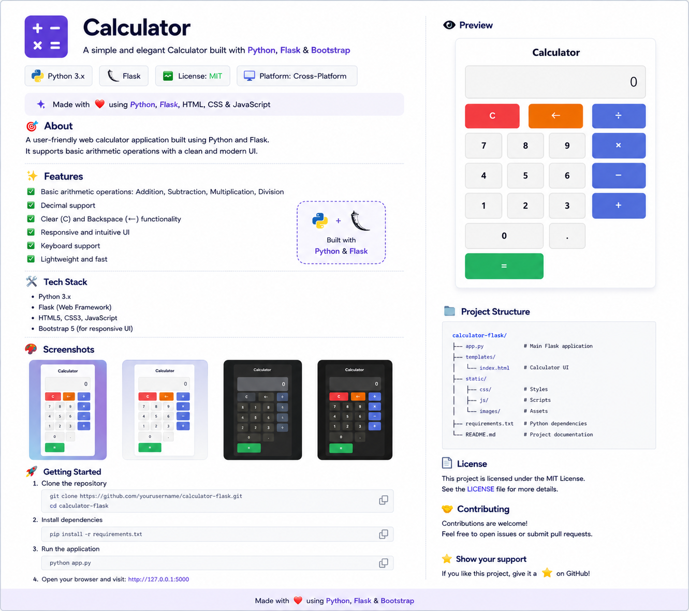
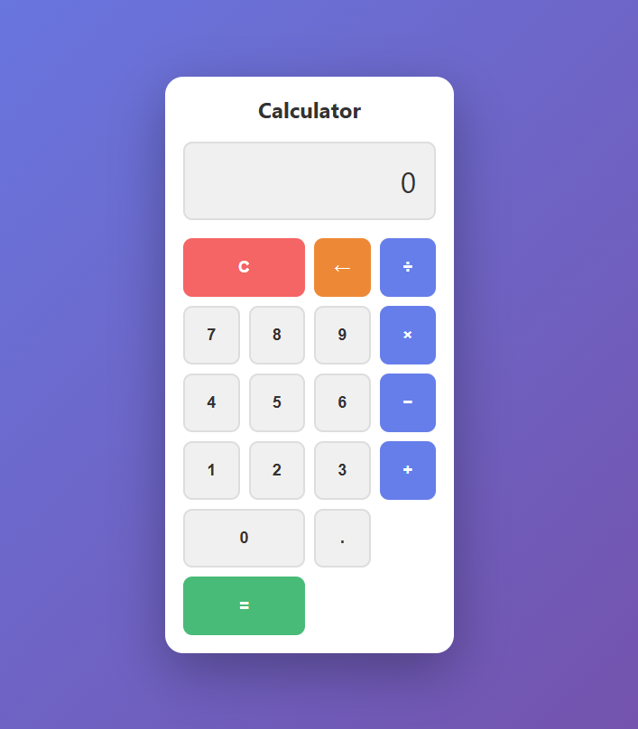

# 🧮 Calculator App

A simple and elegant calculator web application developed using **Python** and **Flask**.  
It supports basic arithmetic operations with a clean, responsive, and user-friendly interface.



---

## 📌 GitHub Description

**A simple calculator web app built with Python and Flask for basic arithmetic operations.**

---

## ✨ Features

- Addition, subtraction, multiplication, and division
- Decimal number support
- Clear button functionality
- Backspace support
- Clean and modern UI
- Lightweight and easy to run
- Browser-based application

---

## 🛠️ Tech Stack

- **Python 3.x**
- **Flask**
- **HTML**
- **CSS**
- **JavaScript**

---

## 📁 Project Structure

```text
calculator-app/
│── cal_app.py
│── templates/
│   └── index.html
│── static/
│   ├── css/
│   │   └── style.css
│   └── js/
│       └── script.js
│── assets/
│   └── calculator-preview.png
│── README.md
```

---

## 🚀 Steps to Run

### 1. Clone the repository

```bash
git clone https://github.com/sumitcoin/Calculator_Python.git
cd calculator-app
```

### 2. Install Flask

```bash
pip install flask
```

### 3. Run the application

```bash
python cal_app.py
```

### 4. Open in browser

```text
http://localhost:5000
```

---

## 📸 Screenshot



---

## ✅ Usage

Open the application in your browser and use the calculator buttons to perform basic calculations.

---

## 📄 License

This project is open-source and free to use.

---

## 👨‍💻 Author

Developed using **Python and Flask**.
